# Create RESTful Services for Spatial Data #

## Description ##

This lab will shows you to create RESTful Services for SPATIAL data

## Step 1: AutoREST Enable a Schema and its SPATIAL Table 

To enable AutoREST on a schema and a table, perform the following steps:

1. On the left-side, the Connections navigator is displayed. To make a new connection, click the down arrow beside + sign and click on **New Connection**.
   
 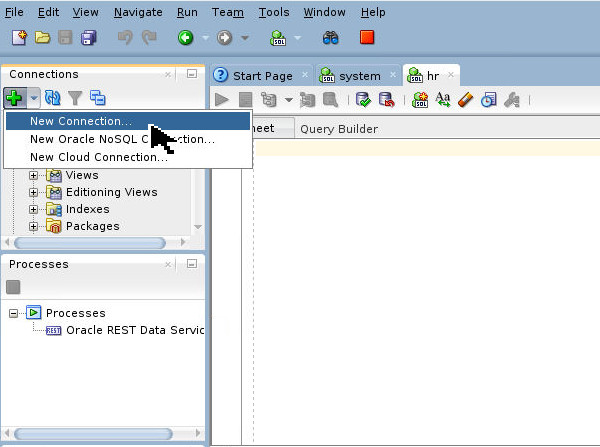
2. Enter the following details:  
    
   Connection Name : SPATIAL  
   Username : appspat  
   Password : Oracle_4U  
   Hostname : <Instance_ip_address>  
   Service Name : SGRPDB  
   Port : 1521  

   Click Test to test the connection.

3. Once the test connection shows Status : **success**, click **connect** to create the connection.

4. On the Connections navigator, connect to **appspat** schema by expanding it.  
   Right click **SPATIAL** and select **REST Services** and then **Enable REST Services**

5. The RESTful Services Wizard will appear. Enter the following and click **Next**.  
   
   |    |   |   |  
   | -------- | -------- | -------- |  
   | Enable schema | Check | Specifies whether the object is available to the Auto Rest service or not |   
   | Schema alias | appspat | This gives the name that is used in the Auto Rest URL to access this object |  
   | Authorization required | Uncheck | When set, only authenticated users with the correct role may access this object |  

  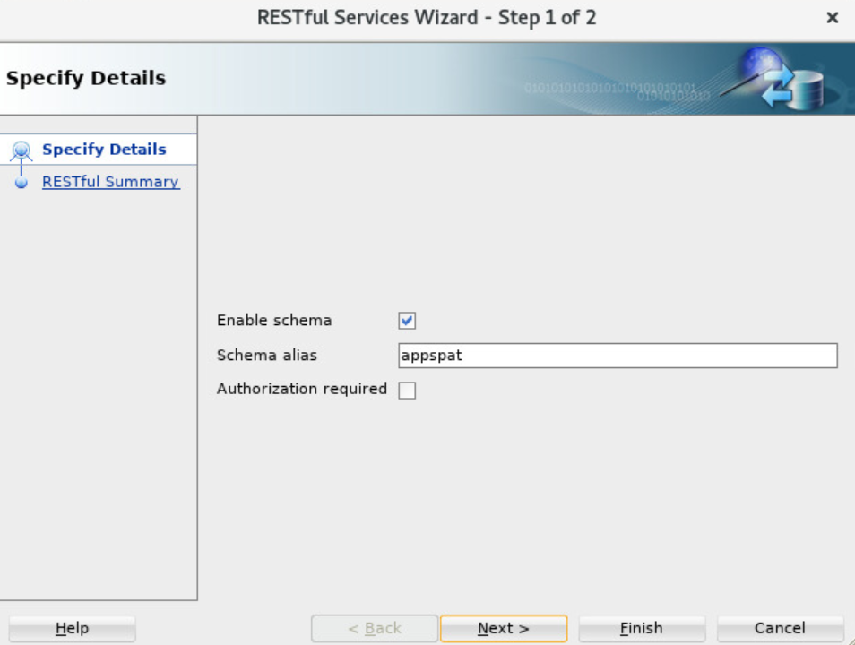
6. The RESTful Summary will appear. Click **Finish**.
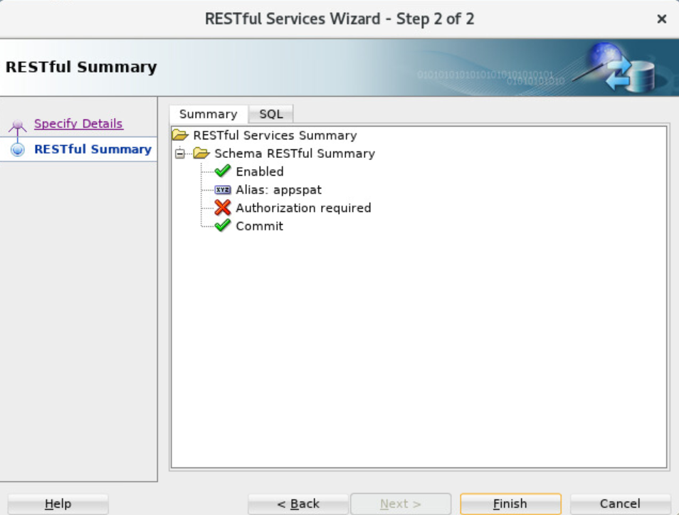
7. The SQL is processed and success message appears. Click **OK**.

8. Now, to AutoREST Enable a table, expand Tables (Filtered) under SPATIAL by clicking + beside it. Right click **WAREHOUSES** and select **Enable REST Service**.

9.  The RESTful Services Wizard will appear. Enter the following and click **Next**.  
       
   |    |   |   |  
   | -------- | -------- | -------- |  
   | Enable object | Check | Specifies whether the object is available to the Auto Rest service or not  |   
   | Object alias | WAREHOUSES | This gives the name that is used in the Auto Rest URL to access this object |  
   | Authorization required | Uncheck | When set, only authenticated users with the correct role may access this object |  

  
10.	This screen gives a summary of the selected operations. Click the SQL tab.

11.	Here is the SQL to REST Enable the table. Click **Finish**.
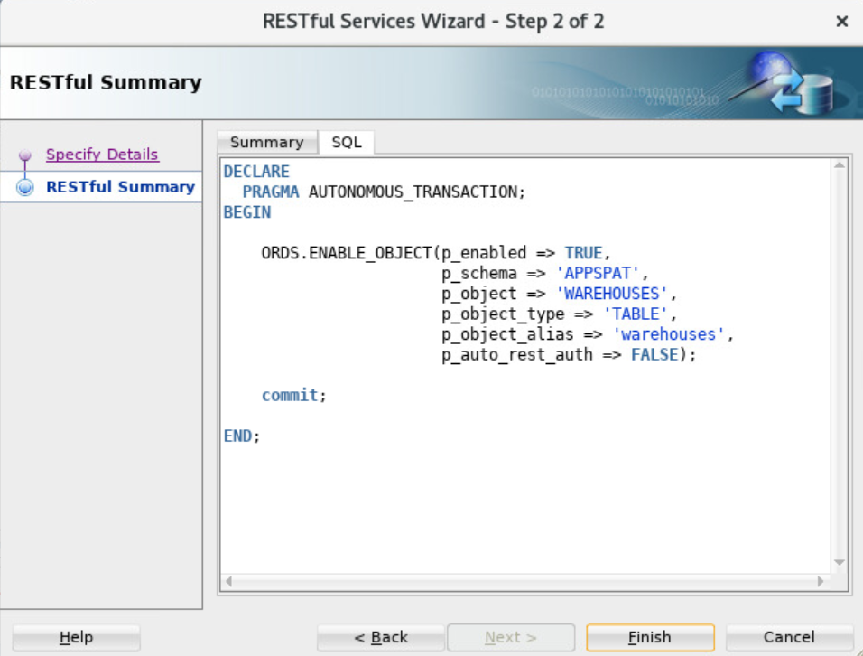
12.	The SQL is processed. Click **OK**.  


The appspat schema and the WAREHOUSES table are now REST enabled.  

## Step 2: Define Resource Module, Resource Template ##

Please Refer **Lab-1 -> step-2** to create resource module and resource template. All those steps will be performed under the DB connection **Spatial**.

## Step 3: Retrieve information from SPATIAL table using GET method ##

1. In the RESTful Services navigator, the resource module **cnvg** contains the resource template **cnvg/:id**.  
  This template retrieves the  information from table WAREHOUSES based on the parameter id. Right click on template **cnvg/:id** then select **Add handler** and select **GET**.

2. On the Edit Resource handler, select source type as **Collection Query** and click on **Apply**.
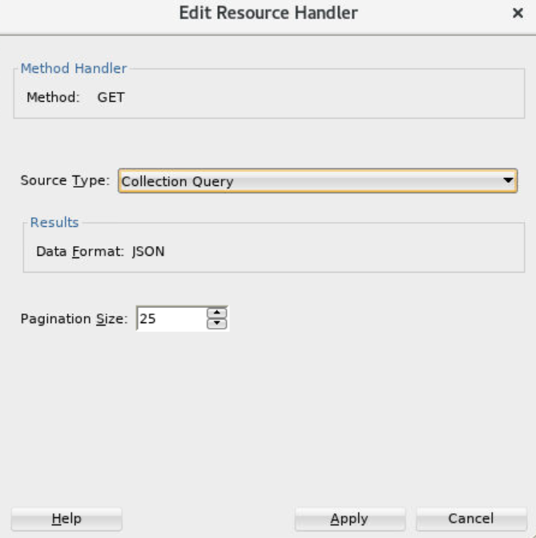
3. The resource handler editor **GET cnvg/:id** is displayed on the right side. Enter the following query in the SQL worksheet and click **Run** statement icon:
     ````
    <copy>

    SELECT
   c.customer_id,
   c.cust_last_name,
   c.GENDER,
   w.warehouse_name
FROM warehouses w,
   customers c
WHERE w.WAREHOUSE_ID = :id
AND sdo_nn (c.cust_geo_location, w.wh_geo_location, 'sdo_num_res=5') = 'TRUE'

    </copy>
    ````
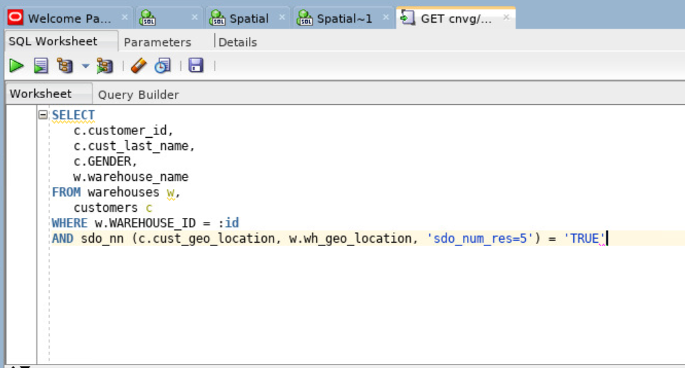
4. The Enter Binds dialog displays. Enter **2** for Value, and click **Apply**. 
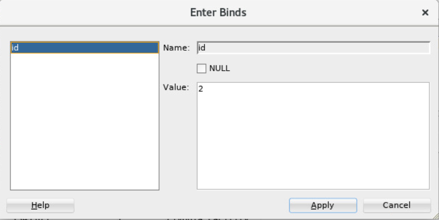
5. The Query Result tab displays all the customers which are near to warehouse with id 2. Save the GET handler.

6. Let’s test the Restful Service. Open Postman.  
   Enter **http://_instanceIPaddress_:9090/ords/sgrpdb/appspat/cnvg/cnvg/2** for URL, and select **GET** for HTTP Method. Then, click **Send** icon located next to the URL field on the top right side.
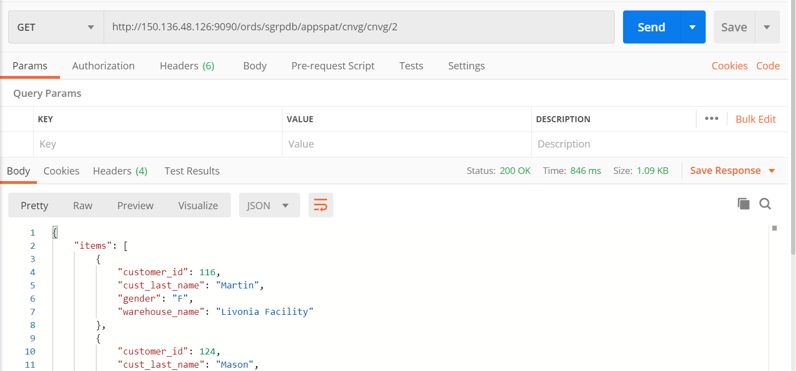
7. Open the browser and test the following URL in the address bar:
   
      ````
    <copy>

   http://instanceIPaddress:9090/ords/sgrpdb/appspat/cnvg/cnvg/2

    </copy>

    ````

8. Now we will use other template **cnvg/** which is present in the resource module **cnvg**. This template will retrieve the whole table information from WAREHOUSES table. Right click on template  **cnvg/** then select **Add handler** and select **GET**.
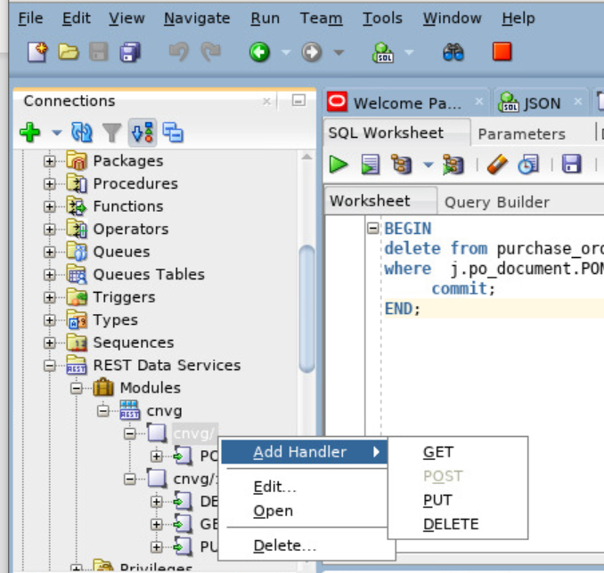
9.  On the Edit Resource handler, select source type as Collection Query and click on **Apply**.

10. The resource handler editor **GET cnvg** is displayed on the right side. Enter the following query in the SQL worksheet and click **Run** statement icon:
     ````
    <copy>

   select * from warehouses;

    </copy>
    ````
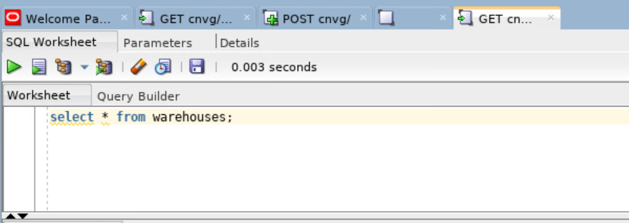
11. The Query Result tab displays the information for the whole table.

12. Let’s test the Restful Service. Open the Postman.  
  Enter http://_instanceIPaddress_:9090/ords/sgrpdb/appspat/cnvg/cnvg/ for URL, and select **GET** for HTTP Method. Then, click **Send** icon located next to the URL field on the top right side.
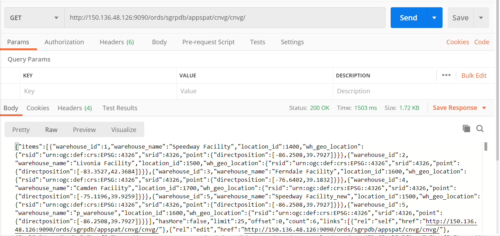
13. Open the browser and test the following URL in the address bar:  
    
   ````
    <copy>

   http://instanceIPaddress:9090/ords/sgrpdb/appspat/cnvg/cnvg/

    </copy>
    ````


## Step 4: Insert data into SPATIAL table using POST method ##

Perform the following steps to create a RESTful Service which inserts the  information into table WAREHOUSES using the HTTP Method POST.

1. Right click on template **cnvg/** then select **Add handler** and select **POST**.

2. In the Mime Types, click the + icon to add a row to the Mime Types. Enter **application/json** and click **Apply**.

3. In the RESTful Services navigator, the resource template **cnvg/** contains the resource handler POST.  
The resource handler editor **POST cnvg/** is displayed on the right-side. Enter the following PL/SQL code in the SQL Worksheet tab. Save the code in the POST handler.
     ````
    <copy>

   BEGIN
    INSERT INTO WAREHOUSES (
        WAREHOUSE_ID,
        WAREHOUSE_NAME,
        LOCATION_ID,
        WH_GEO_LOCATION
    ) VALUES (
        :WAREHOUSE_ID,
        :WAREHOUSE_NAME,
        :LOCATION_ID,
        MDSYS.SDO_GEOMETRY(2001, 4326, MDSYS.SDO_POINT_TYPE(:lon, :lat, NULL), NULL, NULL) 
        );
     commit;
END;


    </copy>
    ````
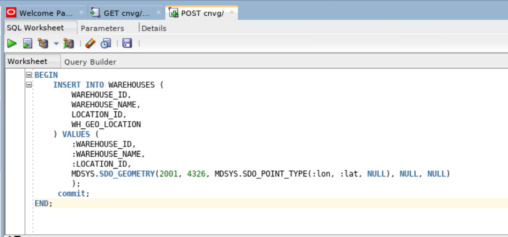
4. Test the Restful Service. Provide following values in the Postman.
Enter **http://_instanceIPaddress_:9090/ords/sgrpdb/appspat/cnvg/cnvg/**
for URL, and select **POST** for HTTP Method.  
For the body select **raw** and **JSON** from dropdown, enter below warehouse entry in the body section.  
Then, click **Send** icon located next to the URL field on the top right side.
     ````
    <copy>

 {
       "WAREHOUSE_ID":"5",
        "WAREHOUSE_NAME":"p_warehouse",
        "LOCATION_ID":"1600",
        "lon": "-86.2508",
        "lat": "39.7927"
}

    </copy>
    ````
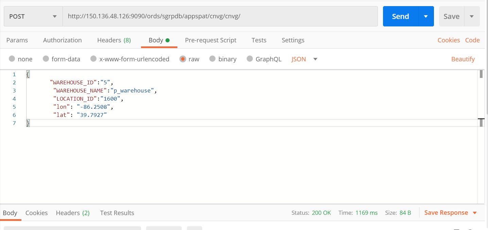

   Once we get the **Status:200 OK**, POST is successfully done.
5. Open the browser and test the following URL in the address bar. This will display results for all of the customers which are near to warehouse with id 5.
     ````
    <copy>

 http://instance_IP_address:9090/ords/sgrpdb/appspat/cnvg/cnvg/5

    </copy>
    ````


## Step 5: Update data in SPATIAL table using PUT method ##

1. Right click on template **cnvg/:id** then select **Add handler** and select **PUT**.

2. In the Mime Types, click the + icon to add a row to the Mime Types. Enter **application/json** and click **Apply**.

3. In the RESTful Services navigator, the resource template **cnvg/:id** contains the resource handler PUT.  
The resource handler editor **POST cnvg/:id** is displayed on the right-side.  
Enter the following PL/SQL code in the SQL Worksheet tab. **Save the code** in the PUT handler.
     ````
    <copy>

      BEGIN    
      UPDATE WAREHOUSES
      set WAREHOUSE_NAME= :WAREHOUSE_NAME 
      WHERE WAREHOUSE_ID= :id;
      commit;
      END;

    </copy>
    ````
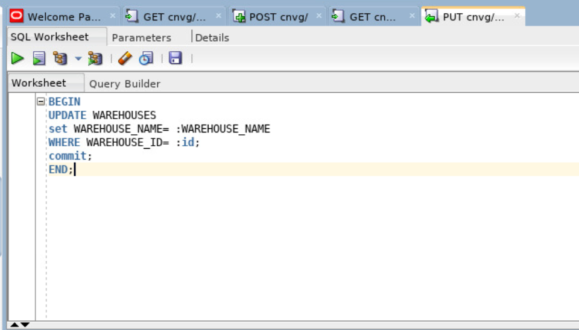
4. Test the Restful Service. Provide following values in the Postman.  
Enter http://_instanceIPaddress_:9090/ords/sgrpdb/appspat/cnvg/cnvg/5 for URL, and select **PUT** for HTTP Method.  
For the body select **raw** and **JSON** from dropdown, update warehouse name as below in the body section. Then, click **Send** icon located next to the URL field on the top right side.
     ````
    <copy>

      {
        "WAREHOUSE_NAME":"put_new__warehouse"
      }

    </copy>
    ````

   Once we get the **Status:200 OK**, PUT is successfully done.
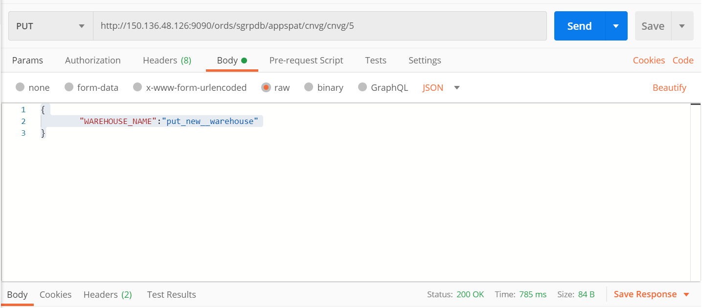

5. Open the browser and test the following URL in the address bar. Check the warehouse name , it is changed to “put\_new\_warehouse"
     ````
    <copy>

      http://instanceIPaddress:9090/ords/sgrpdb/appspat/cnvg/cnvg/5 

    </copy>
    ````
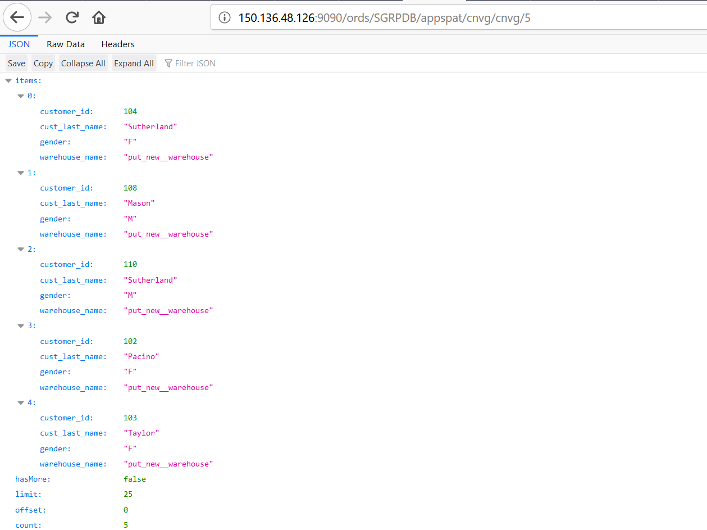


## Step 6: Delete data in SPATIAL table using DELETE method ##

1. In the RESTful Services navigator, right-click **cnvg/:id**, select **Add Handler** and then select **DELETE**.

2. Click **Apply**.

3. The resource handler editor **DELETE cnvg/:id** is displayed on the right-side. Enter the following PL/SQL code in the SQL Worksheet tab and **save** it.
     ````
    <copy>

     BEGIN
     delete from WAREHOUSES
     WHERE WAREHOUSE_ID= :id;
     commit;
     END;
  
    </copy>
    ````

4. Test the Restful Service. Provide following values in the Postman.  

    Enter **http://_instanceIPaddress_:9090/ords/sgrpdb/appspat/cnvg/cnvg/5** for URL, and select **DELETE** for HTTP Method. Then, click **Send** icon located next to the URL field on the top right side.

     Once we get the Status:200 OK, DELETE is successfully done.


5. Open the browser and test the following URL in the address bar. Check for the warehouse with id 5 and its deleted.
      ````
    <copy>

     http://instanceIPaddress:9090/ords/sgrpdb/appspat/cnvg/cnvg/5
  
    </copy>
    ````
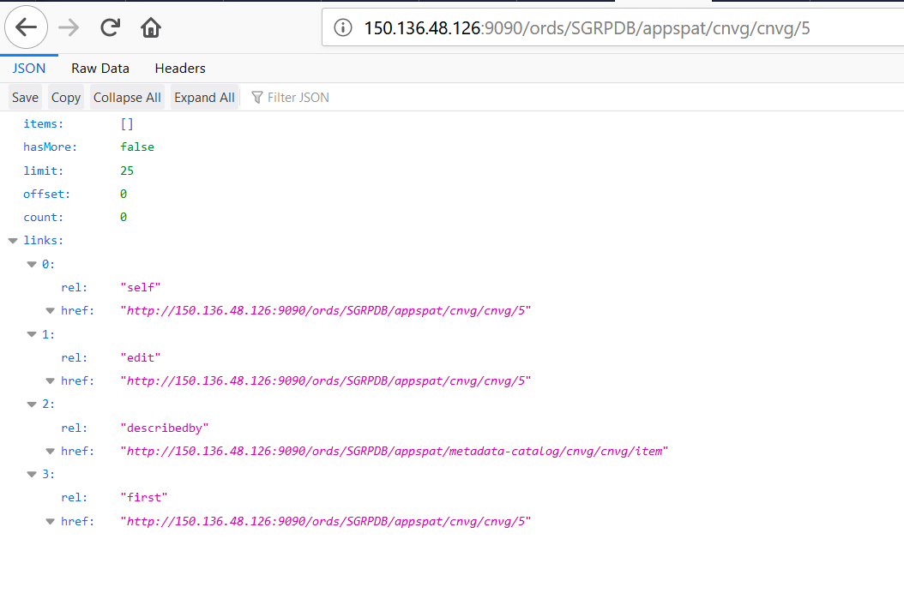


## Acknowledgements

- **Authors** - Balasubramanian Ramamoorthy, Arvind Bhope
- **Contributors** - Laxmi Amarappanavar, Kanika Sharma, Venkata Bandaru, Ashish Kumar, Priya Dhuriya,         Maniselvan K.
- **Team** - North America Database Specialists.
- **Last Updated By** - Kay Malcolm, Director, Database Product Management
- **Expiration Date** - June 2021

**Issues-**
Please submit an issue on our [issues](https://github.com/oracle/learning-library/issues) page. We review it regularly.